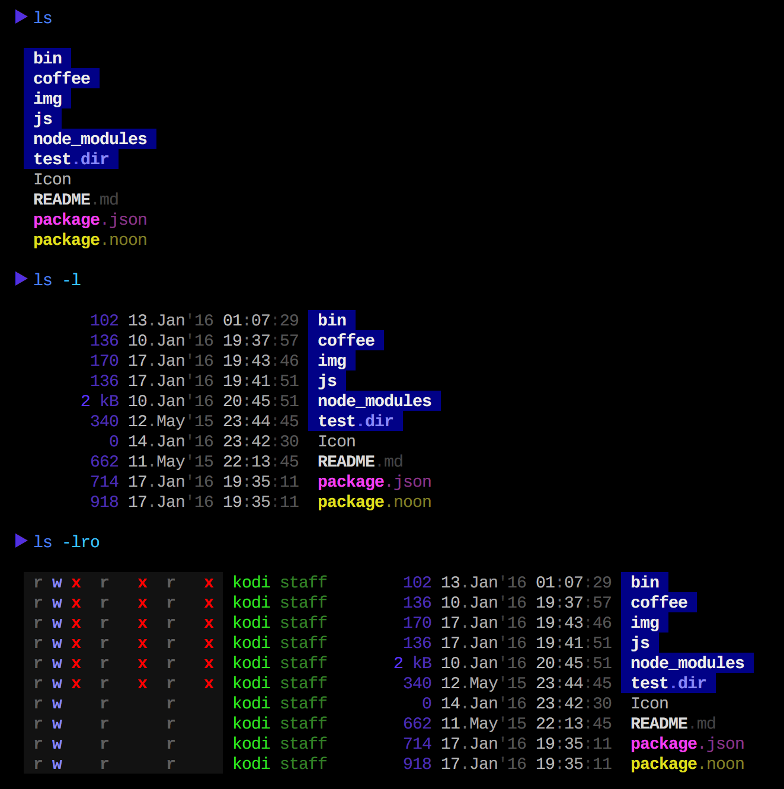
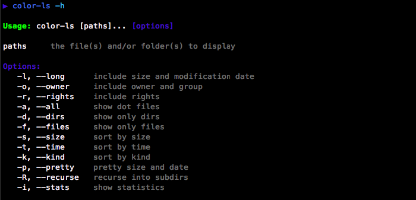
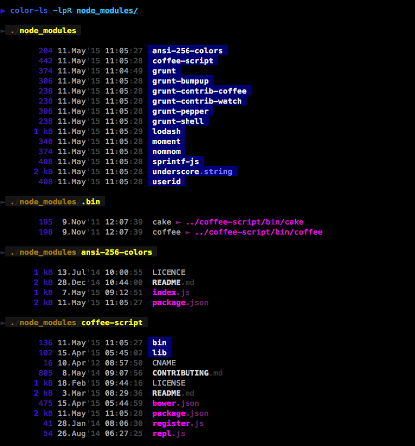
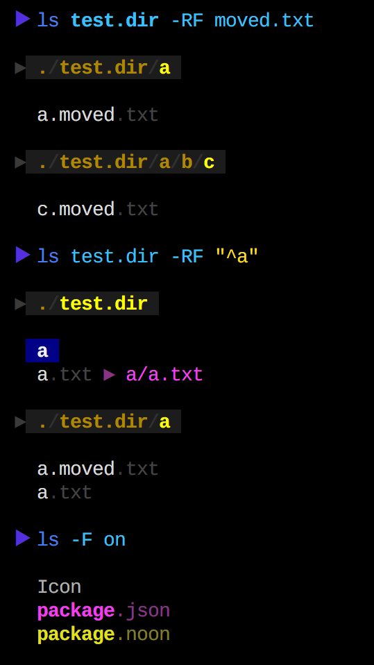

### usage



### recursion



### find files



### install

```shell
npm install -g color-ls
```

### notes

* needs a terminal with 256 colors
* currently optimized for dark backgrounds only
* only a small set of filetypes colorized so far
* call your doctor if your eyes start bleeding :)
