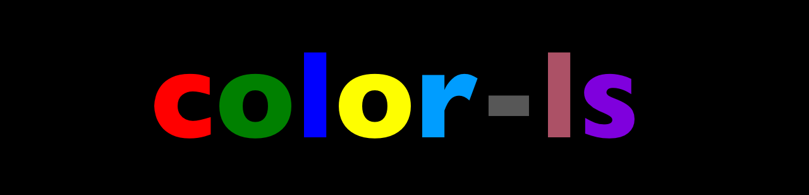
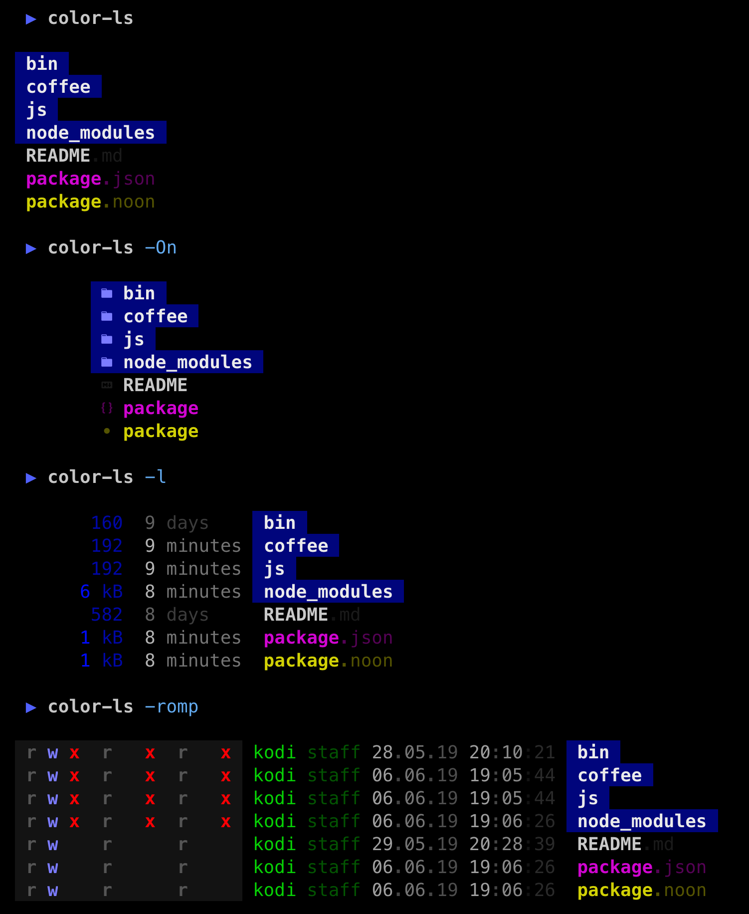
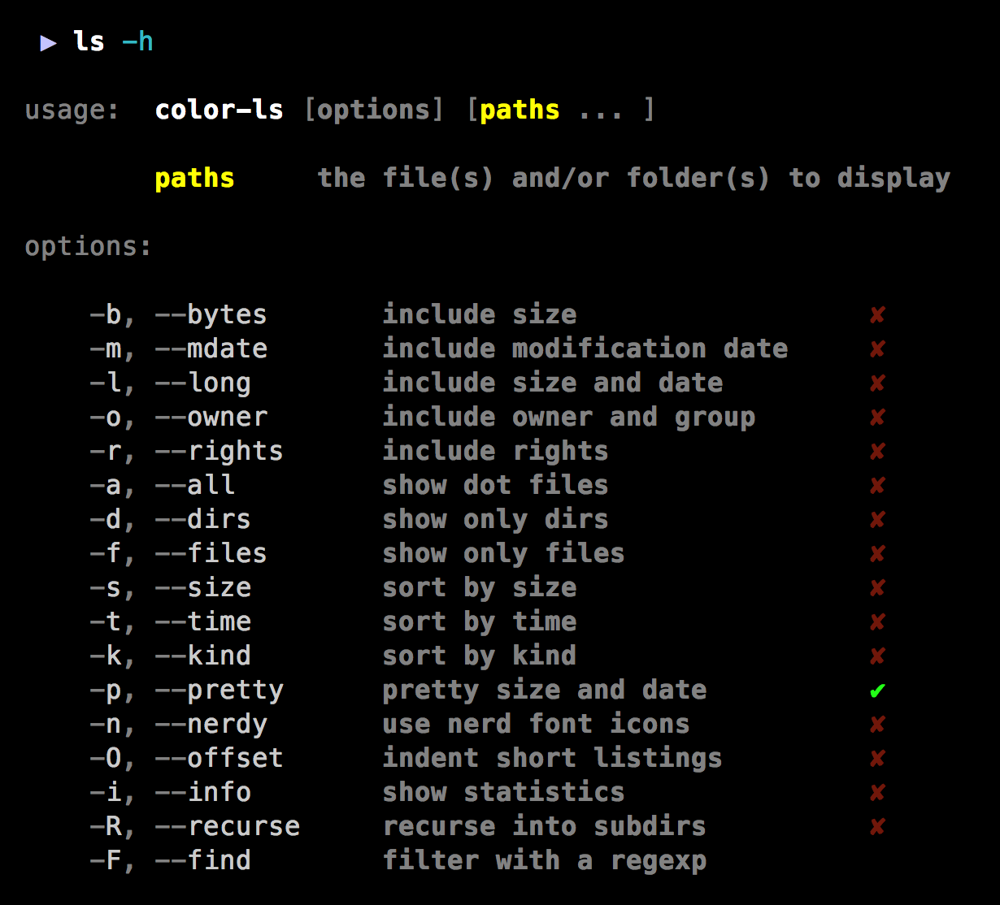
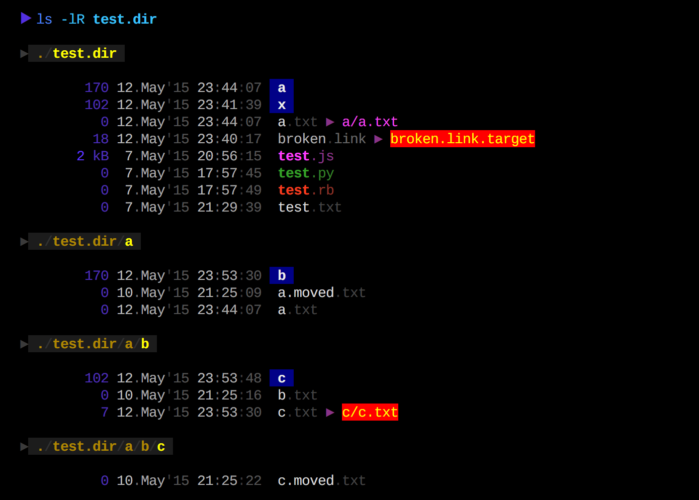
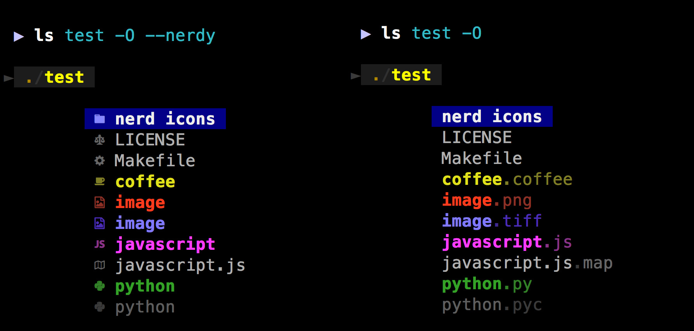

### usage



### recursion



### find files


### nerd font icons



icon map by [lsd](https://github.com/Peltoche/lsd), works only with a [nerd font](https://github.com/ryanoasis/nerd-fonts)

### install

```shell
npm install -g color-ls
```

### notes

* needs a terminal that supports 256 colors
* optimized for dark backgrounds
* call a doctor if your eyes start bleeding :)
